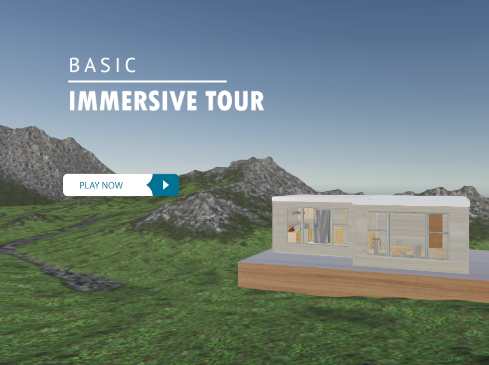
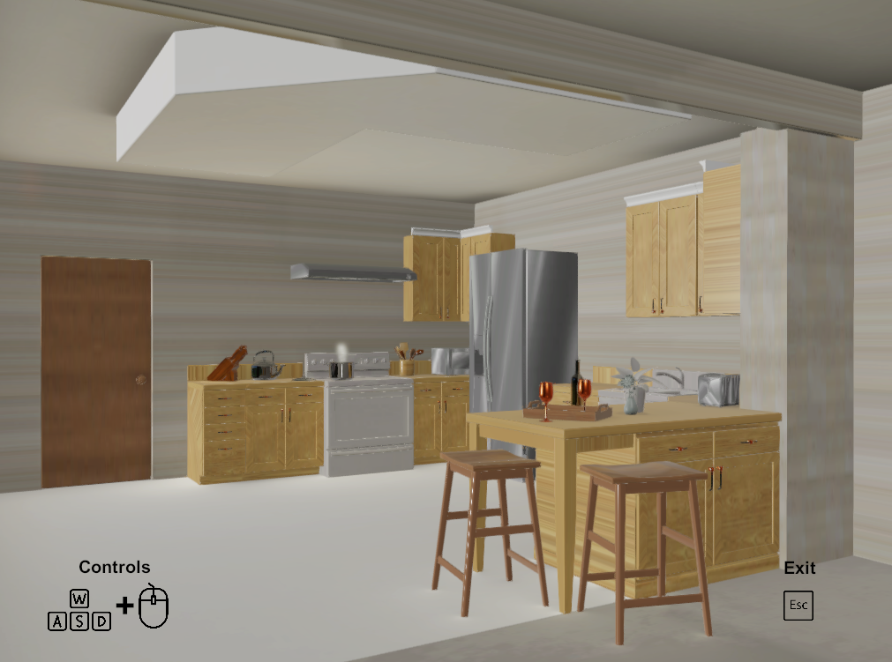

# Basic Immersive House Tour - Unity3
I developed this Windows program, which is a demo about immersive house experience where the player 
discovers the internal environment of the property, in this specific project only living room and kitchen. This 
project was developed in Unity3D that uses First Person Visualization and the house structure was built using 
ProBuilder and Reflection Probe Light tools. To increase the particular experience, was added sound 
effects (radio, boiling water and refrigerator).

## How to install
- [Download the ZIP file (171MB)](https://drive.google.com/uc?export=download&id=1naVsnmnJFUDYieLdCx-EVPhDJtG_MC_8)
- Extract all "Windows" folder 
- Run "Basic Immersive Tour" file application
